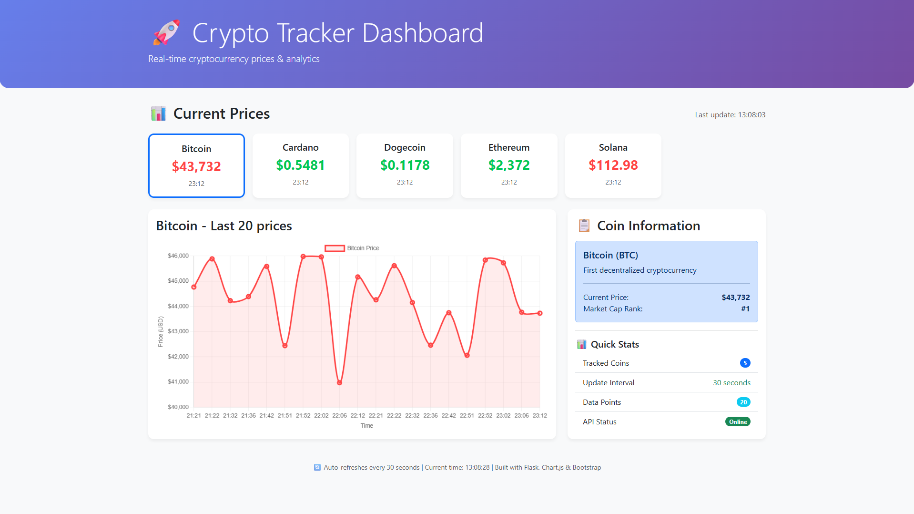

# 🚀 Crypto Tracker - Real-Time Cryptocurrency Dashboard


A full-stack web application for tracking cryptocurrency prices in real-time with interactive charts and analytics.



## ✨ Features

### 📊 **Real-Time Data**
- Live prices from CoinGecko API
- 20+ supported cryptocurrencies
- Auto-refresh every 30 seconds
- Historical data storage with SQLite

### 📈 **Technical Analysis**
- SMA (Simple Moving Average)
- EMA (Exponential Moving Average)
- RSI (Relative Strength Index)
- Dynamic chart colors based on trend

### 🤖 **Trading Bot Simulator**
- Virtual portfolio with $10,000 starting balance
- Buy/Sell cryptocurrencies in real-time
- Real-time P&L tracking
- Transaction history
- Portfolio value calculation

### 🎨 **User Experience**
- Dark/Light mode toggle (saves preference)
- Fully responsive design (mobile, tablet, desktop)
- Interactive charts with Chart.js
- Hybrid view: Top 5 coins as cards + all coins in table

### 📥 **Data Management**
- Export all prices to CSV
- Export individual coin history
- Export active alerts
- Download historical data

### 🔔 **Alert System**
- Set price alerts for any coin
- Email notifications (print to console for demo)
- Active alerts management with delete
- Alert history tracking

### 📱 **Mobile Optimized**
- 2 cards per row on mobile
- Touch-friendly tap targets
- Hidden columns for small screens
- Responsive tables with horizontal scroll

## 🏗️ Architecture
```
crypto-tracker/
├── app.py # Flask application (main)
├── database.py # Database operations
├── data_fetcher.py # API data fetching
├── alerts.py # Price alert system
├── trading.py # Trading bot simulator
├── requirements.txt # Python dependencies
├── README.md # This file
├── .gitignore # Git ignore rules
├── Dockerfile # Docker configuration
├── docker-compose.yml # Docker compose setup
├── static/
│ └── app.js # Frontend JavaScript
└── templates/
├── index.html # Dashboard template
└── home.html # Landing page template
```
## 🚀 Quick Start

### Prerequisites
- Python 3.9+
- pip

### Installation

1. **Clone the repository**
```bash
git clone https://github.com/Pofalors/crypto-tracker.git
cd crypto-tracker

```

2. **Create virtual environment**
```bash
python -m venv venv

# Windows
venv\Scripts\activate

# Mac/Linux
source venv/bin/activate
```

3. **Install dependencies**
```bash
pip install -r requirements.txt
```

4. **Initialize database**
```bash
python database.py
```

5. **Run the application**
```bash
python app.py
```

6. **Access the application**

- Dashboard: http://localhost:5000/dashboard
- API Health: http://localhost:5000/api/health

## 🐳 Docker Setup

### Prerequisites
- Docker Desktop installed

### Run with Docker

```bash
# Clone the repository
git clone https://github.com/Pofalors/crypto-tracker.git
cd crypto-tracker

# Build the image
docker build -t crypto-tracker .

# Run the container
docker run -d -p 5000:5000 --name crypto-tracker crypto-tracker

# Docker Compose
docker-compose up -d

#Stop the container
docker stop crypto-tracker
docker rm crypto-tracker
```
- Dashboard: http://localhost:5000/dashboard


## 📡 API Endpoints

| Method | Endpoint | Description |
|--------|----------|-------------|
| GET | `/api/prices` | Get latest cryptocurrency prices |
| GET | `/api/history/{coin_name}` | Get historical data for specific coin |
| GET | `/api/health` | Check API health status |
| GET | `/dashboard` | Interactive dashboard |

### Alert System

| Method | Endpoint | Description |
|--------|----------|-------------|
| GET | `/api/alerts` | Get all active alerts |
| POST | `/api/alerts/add` | Create new price alert |
| DELETE | `/api/alerts/{id}` | Delete specific alert |

### Trading Bot

| Method | Endpoint | Description |
|--------|----------|-------------|
| GET | `/api/trading/balance` | Get current USD balance |
| GET | `/api/trading/portfolio` | Get current holdings |
| GET | `/api/trading/transactions` | Get transaction history |
| GET | `/api/trading/portfolio-value` | Get total portfolio value |
| POST | `/api/trading/buy` | Buy cryptocurrency |
| POST | `/api/trading/sell` | Sell cryptocurrency |


## Technologies Used

- Backend: Python, Flask, SQLite, APScheduler, Requests
- Frontend: HTML5, CSS3, JavaScript, Bootstrap 5, Chart.js
- DevOps: Docker, GitHub Actions(CI/CD ready)
- APIs: CoinGecko AP
- Tools: Git, VS Code

## 📊 Supported Cryptocurrencies (TOP 5)

- Bitcoin (BTC)
- Ethereum (ETH)
- Cardano (ADA)
- Dogecoin (DOGE)
- Solana (SOL)

## 🎯 Key Features Explained

### Technical Indicators

- SMA (Simple Moving Average): 7-period average showing trend direction
- EMA (Exponential Moving Average): Weighted average reacting faster to price changes
- RSI (Relative Strength Index): 0-100 scale indicating overbought (>70) or oversold (<30) conditions

### Trading Bot

- Start with $10,000 virtual USD
- Buy/sell any supported cryptocurrency
- Real-time P&L calculation
- Average buy price tracking
- Complete transaction history

### Alert System

- Set price alerts for any coin
- Choose "above" or "below" conditions
- Email notifications (console for demo)
- Active alerts management

## 🤝 Contributing

- Fork the project
- Create your feature branch (git checkout -b feature/AmazingFeature)
- Commit your changes (git commit -m 'Add some AmazingFeature')
- Push to the branch (git push origin feature/AmazingFeature)
- Open a Pull Request

## 📝 License

This project is licensed under the MIT License - see the LICENSE file for details.

## 👤 Author

Fanis Spanos
- GitHub: @Pofalors
- LinkedIn: /in/fanis-spanos-049ab6244/

## 🙏 Acknowledgments

- CoinGecko for the cryptocurrency API
- Chart.js for beautiful charts
- Bootstrap for responsive design

# ⭐ Star this repo if you find it useful!
